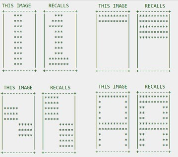

# nunn 2.0
| Linux  | [](https://travis-ci.org/eantcal/nunn)  |

Nunn Library is a Free Open Source Machine Learning Library distributed under MIT License and written in C++17

## Features
- Supports fully connected multi-layers neural networks and other ML algorithms
- Easy to use and understand
- Easy to save and load entire states
- Multi-platform

The library package includes the following samples and tools.

## Nunn Topology -> Graphviz format converter (nunn_topo)
Using this tool you can export neural network topologies and draw them using Graphviz dot.
dot draws directed graphs. It reads attributed graph text files and writes drawings,
either as graph files or in a graphics format such as GIF, PNG, SVG or PostScript
(which can be converted to PDF).

## MNIST Test Demo (mnist_test)
This demonstration involves training and testing an MLP neural network using the MNIST dataset.
The MNIST dataset consists of 60,000 training images plus 10,000 test images. These images are scans of handwritten digits, each with its correct classification.
The images are grayscale and have dimensions of 28 by 28 pixels.
The first part of the dataset, comprising 60,000 images, is used for training the neural network.
The second part, containing 10,000 images, is used for testing the network's performance.
It's important to note that the test data comes from a different set of individuals than the original training data.
During training, the input is treated as a 784-dimensional vector, representing a 28x28 grid of pixel values.
Each entry in the vector corresponds to the grayscale value of a single pixel in the image.
The desired output is a 10-dimensional vector, representing the classification of the digit.
For more information about the MNIST dataset, you can visit the following link: http://yann.lecun.com/exdb/mnist/

### Handwritten Digit OCR Demo (ocr_test)
This is an interactive demo that utilizes a neural network trained on the MNIST dataset. The neural network was created using the nunn library.
The demo makes use of nunn status files (.net), which were generated by the mnist_test application.

### [](https://youtu.be/ereeEG_1lmY)


## TicTacToe Demo (tictactoe)
Basic Tic Tac Toe game which uses neural networks. 

### TicTacToe Demo for Windows (winttt)
Winttt is an interactive version of Tic Tac Toe designed for Windows. It offers the flexibility to be dynamically trained or to utilize pre-trained neural networks, including those created using the tictactoe program.


## XOR Problem sample (xor_test)
The XOR function serves as a typical example of a non-linearly separable function. It has been a classic problem in the field of neural networks, often used as a benchmark for testing their capabilities.
 
### Solving the XOR Problem with Nunn Library
XOR function takes two input arguments with values in [0,1] and returns one output in [0,1], as specified in the following table:

```
 x1|x2 |  y
 --+---+----
 0 | 0 |  0
 0 | 1 |  1
 1 | 0 |  1
 1 | 1 |  0
```

The XOR function, also known as the exclusive-or, computes a result of 1 only when the two inputs have different values. This particular classification cannot be solved with linear separation methods, as it requires a non-linear solution. However, Multi-Layer Perceptron (MLP) neural networks excel at generating such non-linear solutions, making them well-suited for solving the XOR problem.

### Xor function implementation step by step
During the testing phase, an MLP network was trained to perform a specific task. Through training, the algorithm receives examples of desired network behavior and adjusts the weights accordingly. Once the training is complete, the network is capable of providing the desired output for a given input. This iterative process of training allows the MLP network to learn and adapt, ultimately enabling it to produce the desired results.

- Step 1: include MLP NN header
```
#include "nu_mlpnn.h"
#include <iostream>
#include <map>
```
- Step 2: Define net topology

```
int main(int argc, char* argv[])
{
  using vect_t = nu::MlpNN::FpVector;

  nu::MlpNN::Topology topology = {
      2, // input layer takes a two dimensional vector
      2, // hidden layer size
      1  // output
  };
```

- Step 3: Construct the network object specifying topology, learning rate and momentum
```
  try 
  {
      nu::MlpNN nn {
         topology,
         0.4, // learning rate
         0.9, // momentum
      };
```

- Step 4: Create a training set needed to train the net.
Training set must be a collection of <input-vector, output-vector> pairs. 

```
// Create a training set
      using training_set_t = std::map< std::vector<double>, std::vector<double> >;
      training_set_t traing_set = {
         { { 0, 0 },{ 0 } },
         { { 0, 1 },{ 1 } },
         { { 1, 0 },{ 1 } },
         { { 1, 1 },{ 0 } }
      };
```
- Step 5: Train the net using a trainer object. 
Trainer object iterates for each element of training set until the max number of epochs (20000) is reached or error computed by function passed as second parameter to train() method is less than min error (0.01).

```
        nu::MlpNNTrainer trainer(
         nn,
         20000, // Max number of epochs
         0.01   // Min error
      );
      std::cout
         << "XOR training start ( Max epochs count=" << trainer.get_epochs()
         << " Minimum error=" << trainer.get_min_err() << " )"
         << std::endl;
      trainer.train<training_set_t>(
         traing_set,
         [](
            nu::MlpNN& net,
            const nu::MlpNN::FpVector_t & target) -> double
         {
            static size_t i = 0;
            if (i++ % 200 == 0)
               std::cout << ">";
             return net.calcMSE(target);
         }
      );
```

- Step 6: Test if net learnt XOR-function

```
auto step_f = [](double x) { return x < 0.5 ? 0 : 1; };
     std::cout <<  std::endl << " XOR Test " << std::endl;
     for (int a = 0; a < 2; ++a)
     {
        for (int b = 0; b < 2; ++b)
        {  
            vect_t output_vec{ 0.0 };
            vect_t input_vec{ double(a), double(b) }; 

            nn.setInputVector(input_vec);
            nn.feedForward();
            nn.getOutputVector(output_vec);

            // Dump the network status
            std::cout << nn;
            std::cout << "-------------------------------" << std::endl;
            auto net_res = step_f(output_vec[0]);
            std::cout << a << " xor " << b << " = " << net_res << std::endl;
            auto xor_res = a ^ b;
            
            if (xor_res != net_res) {
               std::cerr
                  << "ERROR!: xor(" << a << "," << b << ") !="
                  << xor_res
                  << std::endl; 
               return 1;
            }
            std::cout << "-------------------------------" << std::endl;
        }
     } 
      std::cout << "Test completed successfully" << std::endl;
   }
   catch (nu::MlpNN::Exception & e)
   {
      std::cerr << "nu::mlp_neural_net_t::exception_t n# " << int(e) << std::endl;
      std::cerr << "Check for configuration parameters and retry" << std::endl; 
      return 1;
   }
   catch (...)
   {
      std::cerr
         << "Fatal error. Check for configuration parameters and retry" << std::endl;
      return 1;
   } 
   return 0;
}

```

### Program output

```
XOR training start ( Max epochs count=20000 Minimum error=0.01) 
>>>>>>>>>>>>>>>>>>>>>>>>>>>>>>>>>>>>>>>>> 

XOR Test
Net Inputs
        [0] = 0
        [1] = 0

Neuron layer 0 Hidden
        Neuron 0
                Input  [0] = 0
                Weight [0] = 0.941384
                Input  [1] = 0
                Weight [1] = 0.94404
                Bias =       0.0307751
                Ouput = 0.507693
                Error = 0.0707432
        Neuron 1
                Input  [0] = 0
                Weight [0] = 6.19317
                Input  [1] = 0
                Weight [1] = 6.49756
                Bias =       -0.0227467
                Ouput = 0.494314
                Error = -0.0568667

Neuron layer 1 Output
        Neuron 0
                Input  [0] = 0.507693
                Weight [0] = -16.4831
                Input  [1] = 0.494314
                Weight [1] = 13.2566
                Bias =       -0.00652012
                Ouput = 0.139202
                Error = -0.0171672
-------------------------------
0 xor 0 = 0
-------------------------------
Net Inputs
        [0] = 0
        [1] = 1

Neuron layer 0 Hidden
        Neuron 0
                Input  [0] = 0
                Weight [0] = 0.941384
                Input  [1] = 1
                Weight [1] = 0.94404
                Bias =       0.0307751
                Ouput = 0.726078
                Error = 0.0707432
        Neuron 1
                Input  [0] = 0
                Weight [0] = 6.19317
                Input  [1] = 1
                Weight [1] = 6.49756
                Bias =       -0.0227467
                Ouput = 0.998461
                Error = -0.0568667

Neuron layer 1 Output
        Neuron 0
                Input  [0] = 0.726078
                Weight [0] = -16.4831
                Input  [1] = 0.998461
                Weight [1] = 13.2566
                Bias =       -0.00652012
                Ouput = 0.779318
                Error = -0.0171672
-------------------------------
0 xor 1 = 1
-------------------------------
Net Inputs
        [0] = 1
        [1] = 0

Neuron layer 0 Hidden
        Neuron 0
                Input  [0] = 1
                Weight [0] = 0.941384
                Input  [1] = 0
                Weight [1] = 0.94404
                Bias =       0.0307751
                Ouput = 0.72555
                Error = 0.0707432
        Neuron 1
                Input  [0] = 1
                Weight [0] = 6.19317
                Input  [1] = 0
                Weight [1] = 6.49756
                Bias =       -0.0227467
                Ouput = 0.997914
                Error = -0.0568667

Neuron layer 1 Output
        Neuron 0
                Input  [0] = 0.72555
                Weight [0] = -16.4831
                Input  [1] = 0.997914
                Weight [1] = 13.2566
                Bias =       -0.00652012
                Ouput = 0.77957
                Error = -0.0171672
-------------------------------
1 xor 0 = 1
-------------------------------
Net Inputs
        [0] = 1
        [1] = 1

Neuron layer 0 Hidden
        Neuron 0
                Input  [0] = 1
                Weight [0] = 0.941384
                Input  [1] = 1
                Weight [1] = 0.94404
                Bias =       0.0307751
                Ouput = 0.871714
                Error = 0.0707432
        Neuron 1
                Input  [0] = 1
                Weight [0] = 6.19317
                Input  [1] = 1
                Weight [1] = 6.49756
                Bias =       -0.0227467
                Ouput = 0.999997
                Error = -0.0568667

Neuron layer 1 Output
        Neuron 0
                Input  [0] = 0.871714
                Weight [0] = -16.4831
                Input  [1] = 0.999997
                Weight [1] = 13.2566
                Bias =       -0.00652012
                Ouput = 0.246297
                Error = -0.0171672
-------------------------------
1 xor 1 = 0
-------------------------------
Test completed successfully
```

Topology is defined using a vector of positive integers, where the first element represents the size of the input layer, and the last element represents the size of the output layer. The remaining values represent the sizes of the hidden layers, arranged from input to output. The topology vector should contain at least three items, and all items must be non-zero positive integers.

## Perceptron AND Sample (and_test)
The perceptron implementation of the AND function is an example of a linearly separable function. A single perceptron neural network can learn this type of function. The AND function computes the logical AND operation, resulting in an output of 1 only when both input values are 1.

## Hopfield Test (hopfield_test)
Hopfield networks can be utilized to solve the recall problem by matching cues from an input pattern to a pre-learned pattern. These networks are a form of recurrent artificial neural networks that function as content-addressable memory systems, using binary threshold nodes. This test demonstrates the use of a Hopfield network as an auto-associative memory. In this example, a 100-pixel picture is recognized using a 100-neuron neural network.



# Reinforcement learning
The reinforcement learning library provides algorithms for implementing reinforcement learning, a machine learning approach focused on decision-making and maximizing rewards. Specifically, it includes implementations of Q-learning and SARSA (State–action–reward–state–action) algorithms.

Reinforcement learning is a branch of machine learning that involves an agent interacting with an environment, learning from feedback in the form of rewards or punishments. Q-learning is a popular algorithm used in reinforcement learning for learning optimal action-selection policies based on an action-value function. SARSA is another reinforcement learning algorithm that focuses on estimating the Q-values of state-action pairs.

These algorithms are fundamental tools in reinforcement learning and are useful for solving various problems that involve sequential decision-making in dynamic environments.

See the maze (https://github.com/eantcal/nunn/blob/master/examples/maze/maze.cc) and path finder (https://github.com/eantcal/nunn/blob/master/examples/path_finder/path_finder.cc) examples.
