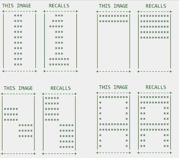

# Nunn 2.0

| Platform | Status |
|---|---|
| Linux | [](https://travis-ci.org/eantcal/nunn) |

**Nunn** is a free and open-source machine learning library written in **C++17** and distributed under the **MIT License**.

The project aims to provide a compact, understandable, and practical framework for experimenting with neural networks and other machine learning algorithms in modern C++.

## Features

- Support for fully connected multilayer neural networks and additional machine learning algorithms
- Simple and easy-to-understand design
- Save and load complete model states
- Cross-platform
- Includes demos and sample applications

## Project contents

The library package includes a collection of demos and tools that illustrate different machine learning techniques and use cases.

## Included demos and tools

### MNIST test demo (`mnist_test`)

`mnist_test` demonstrates how to train and evaluate an MLP neural network on the **MNIST** handwritten digit dataset.

The MNIST dataset contains:

- **60,000 training images**
- **10,000 test images**

Each image is a **28×28 grayscale** digit. When flattened, each sample becomes a **784-dimensional input vector**. The expected output is a **10-dimensional vector** representing the digit classes from **0 to 9**.

The first 60,000 images are used for training, while the remaining 10,000 are used for evaluation. Since the test set comes from different writers than the training set, it provides a meaningful measure of generalization.

More information about MNIST:  
http://yann.lecun.com/exdb/mnist/

### Handwritten digit OCR demo (`ocr_test`)

`ocr_test` is an interactive OCR demo built on top of a neural network trained with `mnist_test`.

The trained network is saved as a Nunn status file (`.net`) and then loaded by `ocr_test` for real-time handwritten digit recognition.

[](https://youtu.be/ereeEG_1lmY)


### TicTacToe demo (`tictactoe`)

A basic Tic Tac Toe example powered by neural networks.

### TicTacToe demo for Windows (`winttt`)

`winttt` is an interactive Windows version of the Tic Tac Toe demo. It can either be trained dynamically or use pre-trained neural networks, including networks generated by `tictactoe`.


### XOR problem sample (`xor_test`)

The XOR function is a classic example of a **non-linearly separable** problem and has historically been used to demonstrate the value of multilayer neural networks.

The XOR function takes two binary inputs and produces one binary output:

```text
 x1 | x2 | y
----+----+---
 0  | 0  | 0
 0  | 1  | 1
 1  | 0  | 1
 1  | 1  | 0
```

A linear model cannot solve this problem correctly, while an MLP can learn the required non-linear decision boundary.

#### Defining the network topology

In Nunn, topology is defined as a vector of positive integers:

- the **first** element is the input layer size
- the **last** element is the output layer size
- the elements in between represent hidden layers, ordered from input to output

The topology vector must contain at least three elements, and all values must be non-zero positive integers.

#### Step-by-step example

**1. Include the required headers**

```cpp
#include "nu_mlpnn.h"
#include <iostream>
#include <map>
```

**2. Define the topology**

```cpp
int main(int argc, char* argv[])
{
    using vect_t = nu::MlpNN::FpVector;

    nu::MlpNN::Topology topology = {
        2, // input layer
        2, // hidden layer
        1  // output layer
    };
```

**3. Construct the network**

```cpp
    try
    {
        nu::MlpNN nn{
            topology,
            0.4, // learning rate
            0.9  // momentum
        };
```

**4. Create the training set**

The training set is a collection of input/output pairs.

```cpp
        using training_set_t = std::map<std::vector<double>, std::vector<double>>;

        training_set_t training_set = {
            {{0, 0}, {0}},
            {{0, 1}, {1}},
            {{1, 0}, {1}},
            {{1, 1}, {0}}
        };
```

**5. Train the network**

The trainer iterates over the dataset until either:

- the maximum number of epochs is reached, or
- the error falls below the configured minimum

```cpp
        nu::MlpNNTrainer trainer(
            nn,
            20000, // max epochs
            0.01   // minimum error
        );

        std::cout
            << "XOR training start (Max epochs count=" << trainer.get_epochs()
            << ", Minimum error=" << trainer.get_min_err() << ")"
            << std::endl;

        trainer.train<training_set_t>(
            training_set,
            [](
                nu::MlpNN& net,
                const nu::MlpNN::FpVector_t& target) -> double
            {
                static size_t i = 0;
                if (i++ % 200 == 0)
                    std::cout << ">";
                return net.calcMSE(target);
            }
        );
```

**6. Test the trained network**

```cpp
        auto step_f = [](double x) { return x < 0.5 ? 0 : 1; };

        std::cout << std::endl << "XOR Test" << std::endl;

        for (int a = 0; a < 2; ++a)
        {
            for (int b = 0; b < 2; ++b)
            {
                vect_t output_vec{0.0};
                vect_t input_vec{double(a), double(b)};

                nn.setInputVector(input_vec);
                nn.feedForward();
                nn.getOutputVector(output_vec);

                std::cout << nn;
                std::cout << "-------------------------------" << std::endl;

                auto net_res = step_f(output_vec[0]);
                std::cout << a << " xor " << b << " = " << net_res << std::endl;

                auto xor_res = a ^ b;
                if (xor_res != net_res)
                {
                    std::cerr
                        << "ERROR!: xor(" << a << "," << b << ") != "
                        << xor_res << std::endl;
                    return 1;
                }

                std::cout << "-------------------------------" << std::endl;
            }
        }

        std::cout << "Test completed successfully" << std::endl;
    }
    catch (...)
    {
        std::cerr << "Fatal error. Check configuration parameters and retry" << std::endl;
        return 1;
    }

    return 0;
}
```

#### Sample output

```text
XOR training start (Max epochs count=20000, Minimum error=0.01)
>>>>>>>>>>>>>>>>>>>>>>>>>>>>>>>>>>>>>>>>> 

XOR Test
...
Test completed successfully
```

### Perceptron AND sample (`and_test`)

This sample shows how a single perceptron can solve the **AND** function, which is a classic example of a **linearly separable** problem.

The AND function returns `1` only when both inputs are `1`.

### Hopfield test (`hopfield_test`)

This example demonstrates how a **Hopfield network** can be used as an auto-associative memory system.

Hopfield networks are recurrent neural networks that can recall a previously learned pattern from incomplete or noisy input. In this sample, a **100-pixel image** is recognized using a **100-neuron** neural network.



### Topology to Graphviz converter (`nunn_topo`)

`nunn_topo` exports neural network topologies to **Graphviz DOT** format.

This makes it possible to visualize network structures using the Graphviz `dot` tool, which can generate diagrams in formats such as **GIF**, **PNG**, **SVG**, and **PostScript**.

## Reinforcement learning

Nunn also includes reinforcement learning components, with implementations of:

- **Q-learning**
- **SARSA** (State–Action–Reward–State–Action)

Reinforcement learning focuses on training an agent to make decisions by interacting with an environment and maximizing cumulative reward over time.

These algorithms are useful for solving sequential decision-making problems and are demonstrated in the following examples:

- [Maze example](https://github.com/eantcal/nunn/blob/master/examples/maze/maze.cc)
- [Path finder example](https://github.com/eantcal/nunn/blob/master/examples/path_finder/path_finder.cc)
