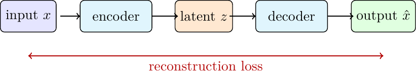

# Classical and Unsupervised Models

Not every learning problem starts with labeled examples. nuNN also includes models for regression, clustering, dimensionality reduction, associative memory, reconstruction, and probabilistic representation learning. These algorithms are useful both as independent tools and as conceptual preparation for neural networks.

## Linear Regression

`LinearRegression` models a target as a linear combination of input features:

```text
y_hat = w * x + b
```

The implementation supports two training modes:

- Ordinary Least Squares, solved with QR factorization;
- gradient descent, useful for connecting regression to neural-network training.

OLS is usually the practical choice for linear regression: it has no learning rate, no epochs, and no convergence curve to tune. The gradient-descent path is educational because it exposes the same update pattern used later by MLPs:

```text
w <- w - eta * grad_w
b <- b - eta * grad_b
```

Implementation:

- `nunn/neural_networks/inc/nu_linear_regression.h`

Demo:

- `linear_regression_demo`

## K-Means

K-Means groups examples into `k` clusters by repeatedly assigning samples to the nearest centroid and then moving each centroid to the mean of the samples assigned to it.

The algorithm is simple and useful when the question is: do the data naturally form compact groups?

Practical points:

- the number of clusters `k` must be chosen by the user;
- feature scale matters because distance drives the assignment;
- different initial centroids can lead to different final clusters.

Implementation:

- `nunn/neural_networks/inc/nu_kmeans.h`

Demo:

- `kmeans_demo`

## PCA

Principal Component Analysis finds orthogonal directions of maximum variance. After centering the data, PCA projects samples onto the first components:

```text
X_reduced = X_centered * V_k
```

PCA is useful for visualization, compression, denoising, and preprocessing. Its limitation is linearity: if the important structure is curved or strongly nonlinear, an autoencoder may be more expressive.

Implementation:

- `nunn/neural_networks/inc/nu_pca.h`

Demo:

- `pca_demo`

## Hopfield Network

A Hopfield network is an associative memory. It stores binary patterns as stable attractors. During recall, it starts from a partial or noisy pattern and updates neurons until it reaches a stable state.

The classical weight rule stores correlations between pattern components:

```text
W_ij += pattern_i * pattern_j
W_ii = 0
```

The important limitation is capacity. A classical Hopfield network stores only a small fraction of the number of neurons reliably, often approximated as:

```text
capacity ~= 0.138 * N
```

Above that range, memories interfere and recall can converge to a wrong or mixed pattern.

Implementation:

- `nunn/neural_networks/inc/nu_hopfieldnn.h`

Demo:

- `hopfield_test`

## Autoencoder

An autoencoder learns to reconstruct its own input through a bottleneck:

```text
x -> encoder -> z -> decoder -> x_hat
```

The reconstruction objective is usually MSE:

```text
loss = ||x - x_hat||^2
```

The bottleneck forces the network to keep the information that is most useful for reconstruction. Compared with PCA, an autoencoder can learn nonlinear compression because the encoder and decoder use activation functions.



Implementation:

- `nunn/neural_networks/inc/nu_autoencoder.h`

Demo:

- `ae_demo`

## RBM

A Restricted Boltzmann Machine is a probabilistic energy-based model with visible units and hidden units. Connections exist between the two layers, but not inside a layer.

RBMs are trained through sampling, commonly with Contrastive Divergence. This makes them different from autoencoders: the model learns a probability structure, not a deterministic encoder-decoder mapping.

Use the RBM demo to observe reconstruction quality and hidden feature discovery on small binary patterns.

Implementation:

- `nunn/neural_networks/inc/nu_rbm.h`

Demo:

- `rbm_demo`

## VAE

A Variational Autoencoder combines an encoder-decoder architecture with a probabilistic latent space. Instead of producing one latent vector, the encoder predicts distribution parameters:

```text
encoder(x) -> mu, log_var
z = mu + sigma * epsilon
```

The reparameterization trick keeps sampling compatible with gradient-based training. A VAE is useful when the latent space should be smooth enough for generation, interpolation, or structured sampling.

Implementation:

- `nunn/neural_networks/inc/nu_vae.h`

Demo:

- `vae_demo`

## RBF Network

An RBF network uses hidden units centered in input space:

```text
h_j(x) = exp(-||x - c_j||^2 / (2 * sigma_j^2))
```

It can be read as a bridge between clustering and supervised learning. First choose centers, then train the output weights.

Implementation:

- `nunn/neural_networks/inc/nu_rbf.h`

Demo:

- `rbf_demo`

## SOM

A Self-Organizing Map projects high-dimensional data onto a grid of neurons. For each sample, the closest neuron is the Best Matching Unit. The BMU and its neighbors move toward the sample.

Compared with K-Means, SOM keeps a topological grid: nearby neurons tend to represent nearby regions of the input space.

Implementation:

- `nunn/neural_networks/inc/nu_som.h`

Demo:

- `som_demo`

## How These Models Relate

| Model | Main question | Output |
| --- | --- | --- |
| Linear Regression | Can a linear function predict the target? | coefficients and intercept |
| K-Means | Do examples form compact groups? | cluster assignments and centroids |
| PCA | Which linear directions preserve most variance? | reduced coordinates |
| Hopfield | Can a noisy clue recover a stored pattern? | recalled pattern |
| Autoencoder | Can the input be compressed and reconstructed? | reconstruction and latent vector |
| RBM | Can binary/normalized data be modeled probabilistically? | hidden probabilities and reconstructions |
| VAE | Can we learn a smooth generative latent space? | reconstruction and sampled latent vectors |
| RBF | Can distance to centers solve regression/classification? | supervised prediction |
| SOM | Can high-dimensional data self-organize on a grid? | best matching units and map weights |
