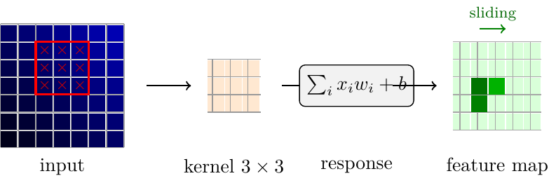
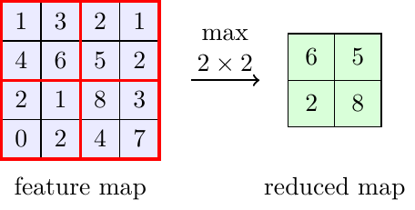

# Convolutional Networks and Transformer

## Conv1DLayer / MaxPool1DLayer / ConvNet

nuNN includes a compact 1D convolutional pipeline:

- `Conv1DLayer`
- `MaxPool1DLayer`
- `ConvNet`

The convolution layer applies small filters over local windows. This gives the model local pattern sensitivity while sharing weights across positions.

Max pooling reduces the sequence length by keeping the strongest local response.

The `ConvNet` builder chains convolution/pooling layers and attaches an `MlpMatrixNN` head. Backpropagation is end-to-end, including the gradient from the MLP head back into the convolutional layers.

Demo:

- `cnn_seq`

## MiniTransformer

The transformer implementation is intentionally compact and educational. It includes:

- `LayerNorm`
- `SelfAttentionLayer`
- `TransformerBlock`
- `MiniTransformer`

The attention layer uses causal masking for autoregressive character generation. The model supports training with softmax cross-entropy and generation with temperature scaling.

Demo:

- `transformer_char`

