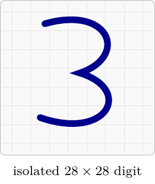
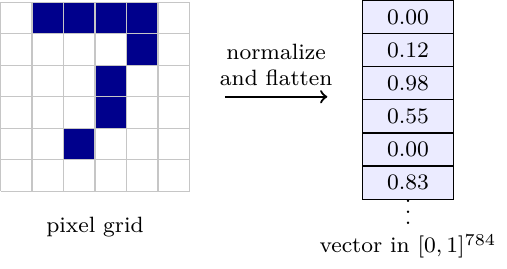
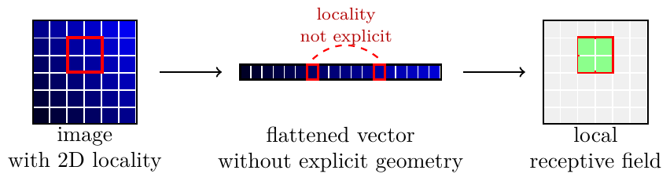

# MNIST and OCR

nuNN includes both a command-line MNIST trainer and a Windows OCR GUI. Together they show the full supervised-learning chain: load labeled data, convert it into vectors, train a network, save the model, reload it, and use it interactively.

## MNIST Data Representation

MNIST contains handwritten digits split into 60,000 training images and 10,000 test images. Each image is grayscale and has size 28 by 28 pixels.



An MLP expects a vector, so each image is normalized and flattened:

```text
28 * 28 pixels -> 784 input values in [0, 1]
```



The label is converted to a one-hot target with 10 entries. For example, digit `3` becomes:

```text
[0, 0, 0, 1, 0, 0, 0, 0, 0, 0]
```

This matters because the network should not treat digit labels as ordered scalar values. The class `8` is not "close" to class `9` in the target representation; it is a different category.



## Data Loading

MNIST support lives in:

- `mnist/mnist.h`
- `mnist/mnist.cc`

`TrainingData` reads IDX image and label files, checks the magic numbers and dimensions, and exposes `DigitData` objects. `DigitData` converts pixels to normalized vectors and labels to one-hot targets.

The examples reshuffle the training data between epochs so the network does not always see samples in the same order.

## `mnist_test`

`mnist_test` trains and evaluates a network on MNIST:

```sh
mnist_test -p /path/to/mnist
```

Current defaults:

- `MlpMatrixNN`
- backend `auto`
- batch size `100`
- hidden layer `300`
- sigmoid activation
- MSE cost

Useful alternatives:

```sh
mnist_test -p /path/to/mnist --mlp
mnist_test -p /path/to/mnist --backend cpu
mnist_test -p /path/to/mnist --backend opencl
mnist_test -p /path/to/mnist --batch 1
```

`--mlp` selects the classic `MlpNN` path. The matrix path is preferred for real MNIST runs because mini-batches and acceleration are more efficient.

## Training vs Test Set

Training loss answers: is the optimizer reducing the error on examples used for weight updates?

Test accuracy answers: does the learned mapping work on examples that were not used to update the weights?

Both signals are important. A falling loss with poor test accuracy can indicate overfitting, bad preprocessing, or a mismatch between the training representation and the runtime input.

## `ocr_test`

`ocr_test` is the interactive handwritten digit demo. It can:

- load `.net` and JSON models;
- recognize a digit drawn by the user;
- train a new MNIST model from the Train menu;
- persist MNIST and save paths in the Windows registry;
- show a cost-convergence chart during training;
- select `Auto`, `CPU`, or `OpenCL` backend.

At recognition time, the drawing is resampled into the same representation used by MNIST: a normalized 28 by 28 grid flattened into 784 values. From that point on, recognition is a normal forward pass. The predicted digit is the output neuron with the largest activation.

## Model Discovery

The installed package places OCR models under:

```text
bin/models
```

`ocr_test` also searches:

```text
bin
../share/nunn/nets
../share/nunn/models
```

This keeps the GUI usable both from the build tree and from an installed package.

## Practical Checks

If a saved model gives random-looking answers after reload, check:

- the model format was saved and loaded with the same topology;
- the input size is 784 for MNIST/OCR;
- the OCR preprocessing produces values in the same range as training;
- the model was trained long enough for the cost curve to converge;
- the GUI is loading the intended JSON or `.net` file, not an older default model.

