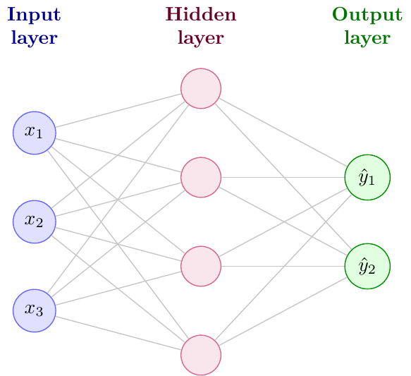
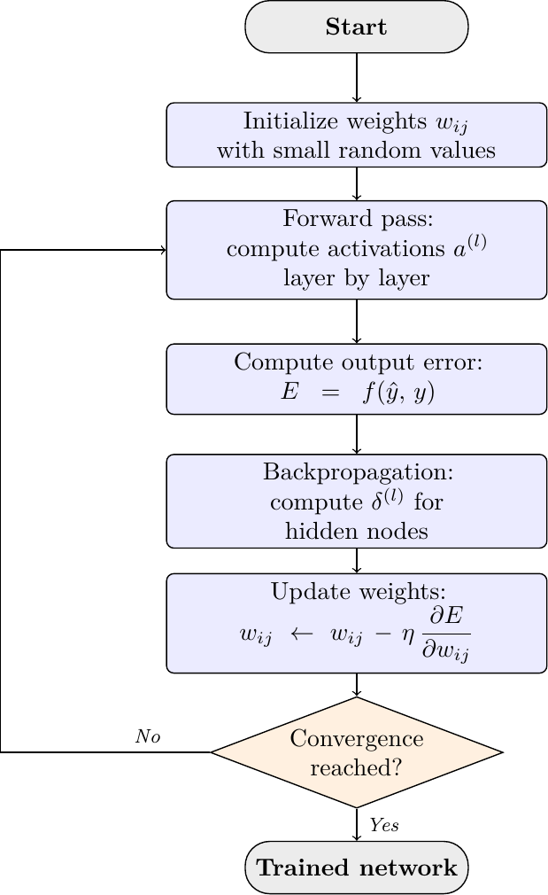

# Neural Networks

nuNN implements neural networks in a deliberately readable way. The same concepts appear twice in the MLP code: first as explicit neurons and weights, then as matrix operations. This makes the library useful both for learning the algorithm and for running larger experiments such as MNIST.



## Perceptron

The perceptron is the smallest supervised neural classifier in nuNN. It computes a weighted sum and applies a threshold-like decision rule. It is useful for linearly separable problems and for understanding why hidden layers matter.

A single perceptron cannot solve XOR because XOR is not linearly separable. An MLP fixes this by inserting hidden units that build an intermediate representation before the final decision.

Implementation:

- `nunn/neural_networks/inc/nu_perceptron.h`
- `nunn/neural_networks/src/nu_perceptron.cc`

Demo:

- `and_test`

## MLP Intuition

A multilayer perceptron applies repeated affine transformations followed by nonlinear activations:

```text
z_l = W_l * a_(l-1) + b_l
a_l = f(z_l)
```

Without nonlinear activation functions, a stack of layers would collapse into a single linear transformation. The hidden layers are useful because they let the network combine simple features into more expressive intermediate representations.

Common choices in nuNN include sigmoid, tanh, ReLU, and Leaky ReLU. For MNIST-style classification, the final layer has one output per class and the predicted class is the index with the largest activation.

## `MlpNN`

`MlpNN` is the classic implementation. Neurons, weights, deltas, and updates are explicit in the code, which makes it the best version for studying backpropagation step by step.

Good uses:

- small logic problems such as XOR;
- reading the forward pass and backpropagation without matrix notation;
- comparing online SGD with mini-batch training;
- exporting topology to Graphviz DOT.

Because it updates one sample at a time, `MlpNN` is simple and transparent but not the best choice for larger datasets.

## `MlpMatrixNN`

`MlpMatrixNN` stores activations and weights as vectors and matrices. The forward pass of one layer is the same formula, but the implementation can process mini-batches efficiently.

For a batch, each column can represent one sample. The layer computation becomes a matrix product, and the gradient is averaged across the batch before the update. This is the version used by default by MNIST training.



Current MNIST defaults:

- network type: `MlpMatrixNN`
- backend: `Auto`
- batch size: `100`
- hidden layers: `300`
- learning rate: `0.025`
- momentum: `0.5`

The `Auto` backend uses ArrayFire/OpenCL when the runtime is available and falls back to Eigen/CPU when it is not.

## Loss Functions

nuNN exposes MSE and cross-entropy for MLP training.

MSE is easy to inspect:

```text
MSE = (1/N) * sum_i (y_i - t_i)^2
```

Cross-entropy is usually more appropriate for classification because it focuses directly on the probability assigned to the correct class.

In the OCR training dialog, the convergence chart plots the cost over epochs so the user can see whether the loss is still falling, flattening, or behaving erratically.

## RBF Network

`Rbf` implements a radial basis function network. Hidden units respond to distance from learned or selected centers:

```text
h_j(x) = exp(-||x - c_j||^2 / (2 * sigma_j^2))
```

The model is useful for showing a different style of hidden representation: instead of learning arbitrary affine features, each hidden unit is localized around a center in input space.

Demo:

- `rbf_demo`

## Autoencoder

The autoencoder is an encoder-decoder model built on top of `MlpMatrixNN`. It learns to reconstruct its input after passing through a smaller latent representation.


The bottleneck makes the model useful for studying compression, denoising, and unsupervised representation learning.

Demo:

- `ae_demo`

