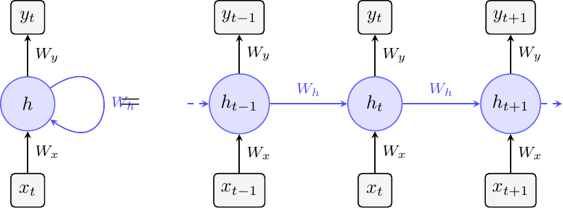
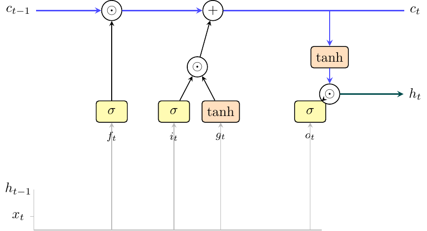

# Recurrent Networks

Recurrent networks reuse parameters while carrying state from one time step to the next. nuNN gives `VanillaRnn`, `Gru`, and `Lstm` the same small public interface, so an experiment can change architecture without changing its sequence loop.



## Shared API and output modes

All three types provide:

```cpp
resetState();
step(input_at_t);
getOutput();
getHidden();
bptt(input_sequence, target_sequence, truncate);
reshuffleWeights();
```

Their constructor shape is also shared:

```cpp
nu::VanillaRnn model(
    inputSize,
    hiddenSize,
    outputSize,
    learningRate,
    gradientClip,
    nu::RnnOutput::Linear
);
```

Replace `VanillaRnn` with `Gru` or `Lstm` and the call sites remain valid.

| `RnnOutput` | Output and loss | Use it for |
| --- | --- | --- |
| `Linear` | identity output, mean squared error | regression and next-value prediction |
| `Softmax` | normalized class probabilities, cross-entropy | sequence classification and language modeling |

The contract is declared in [`nu_rnn.h`](https://github.com/eantcal/nunn/blob/main/nunn/neural_networks/inc/nu_rnn.h), [`nu_gru.h`](https://github.com/eantcal/nunn/blob/main/nunn/neural_networks/inc/nu_gru.h), and [`nu_lstm.h`](https://github.com/eantcal/nunn/blob/main/nunn/neural_networks/inc/nu_lstm.h).

## Training and inference are different loops

For one training sequence, reset state and call `bptt()`:

```cpp
std::vector<std::vector<double>> inputs;
std::vector<std::vector<double>> targets;

model.resetState();
double meanLoss = model.bptt(inputs, targets, 25);
```

`bptt()` advances the state to the end of the sequence and updates weights. The two outer vectors must have the same number of time steps; each inner vector must match the configured input or output size.

For stateful inference, call `step()` repeatedly:

```cpp
model.resetState();

for (const auto& x : inputs) {
    model.step(x);
    const auto& prediction = model.getOutput();
    // Consume prediction before advancing to the next step.
}
```

Call `resetState()` at a true sequence boundary. Omitting it intentionally carries context into the next input; calling it too often destroys memory.

## `VanillaRnn`: the baseline

An Elman RNN computes:

```text
h_t = tanh(Wx x_t + Wh h_(t-1) + b_h)
y_t = output(Wy h_t + b_y)
```

The current input and previous hidden state meet in one new hidden state. This is the cleanest architecture for tracing recurrent forward propagation and backpropagation through time.

- API: [`nu_rnn.h`](https://github.com/eantcal/nunn/blob/main/nunn/neural_networks/inc/nu_rnn.h)
- Forward and BPTT implementation: [`nu_rnn.cc`](https://github.com/eantcal/nunn/blob/main/nunn/neural_networks/src/nu_rnn.cc)
- Tests: [`test_rnn.cc`](https://github.com/eantcal/nunn/blob/main/tests/test_rnn.cc)

Repeated multiplication by the recurrent Jacobian can shrink or grow gradients. Gradient clipping limits explosion; it does not solve vanishing gradients over long spans.

## `Gru`: selective hidden-state updates

The GRU introduces reset and update gates:

```text
r_t = sigmoid(Wr x_t + Ur h_(t-1) + b_r)
z_t = sigmoid(Wz x_t + Uz h_(t-1) + b_z)
g_t = tanh(Wh x_t + Uh (r_t elementwise* h_(t-1)) + b_h)
h_t = (1 - z_t) elementwise* h_(t-1) + z_t elementwise* g_t
```

The reset gate controls how much history enters the candidate. The update gate interpolates between preserving old state and writing the candidate.

The implementation stacks gate computations to reduce separate matrix-vector operations. Follow the split and backward flow in [`nu_gru.cc`](https://github.com/eantcal/nunn/blob/main/nunn/neural_networks/src/nu_gru.cc); behavioral coverage is in [`test_gru.cc`](https://github.com/eantcal/nunn/blob/main/tests/test_gru.cc).

GRU has no separate cell state and fewer parameters than LSTM. In small and medium sequence exercises it is a strong first gated model.

## `Lstm`: a separate memory path

LSTM adds a cell state and three sigmoid gates:

```text
i_t = sigmoid(Wi x_t + Ui h_(t-1) + b_i)
f_t = sigmoid(Wf x_t + Uf h_(t-1) + b_f)
o_t = sigmoid(Wo x_t + Uo h_(t-1) + b_o)
g_t = tanh(Wg x_t + Ug h_(t-1) + b_g)

c_t = f_t elementwise* c_(t-1) + i_t elementwise* g_t
h_t = o_t elementwise* tanh(c_t)
```



The cell update provides a more direct path across time. nuNN initializes the forget-gate bias to 1 so the network begins with a bias toward retention.

- API: [`nu_lstm.h`](https://github.com/eantcal/nunn/blob/main/nunn/neural_networks/inc/nu_lstm.h)
- Gate packing, forward pass, and BPTT: [`nu_lstm.cc`](https://github.com/eantcal/nunn/blob/main/nunn/neural_networks/src/nu_lstm.cc)
- Tests: [`test_lstm.cc`](https://github.com/eantcal/nunn/blob/main/tests/test_lstm.cc)

## Truncated BPTT

A recurrent graph can be unfolded for every time step, but memory and computation grow with sequence length. nuNN's `truncate` parameter bounds how far the backward pass reaches.

A shorter window:

- reduces work and memory;
- limits how far direct credit assignment travels;
- can still learn useful state dynamics when information is refreshed often.

A longer window:

- exposes longer dependencies;
- increases cost;
- can make gradient stability more important.

Each implementation clamps individual gradient elements to `[-gradientClip, +gradientClip]`. If the loss is unstable, inspect scale and learning rate before increasing the clip threshold.

## Source-backed sine predictor

The complete [`rnn_sine`](https://github.com/eantcal/nunn/blob/main/examples/rnn_sine/rnn_sine.cc) uses the shared API to compare all three models. Its construction is:

```cpp
constexpr size_t hidden = 32;
constexpr double learningRate = 0.005;

nu::Gru model(
    1,                            // one scalar input
    hidden,
    1,                            // one scalar prediction
    learningRate,
    5.0,                          // gradient clip
    nu::RnnOutput::Linear
);
```

During evaluation, each predicted sine value becomes the next input. This autoregressive phase is harder than one-step testing with ground-truth inputs because errors feed back into the sequence.

Run each architecture with identical hyperparameters:

```sh
rnn_sine
rnn_sine --gru
rnn_sine --lstm
rnn_sine --gru 2000 64 0.003
```

Positional arguments are `epochs hidden learning_rate`.

## Three examples, three questions

| Example | Question | Command |
| --- | --- | --- |
| [`rnn_sine`](https://github.com/eantcal/nunn/blob/main/examples/rnn_sine/rnn_sine.cc) | Can the model learn and sustain smooth dynamics? | `rnn_sine [--gru|--lstm] [epochs] [hidden] [lr]` |
| [`rnn_adding`](https://github.com/eantcal/nunn/blob/main/examples/rnn_adding/rnn_adding.cc) | Can it retain two marked values across irrelevant steps? | `rnn_adding [seq_len] [hidden] [epochs] [lr]` |
| [`rnn_char`](https://github.com/eantcal/nunn/blob/main/examples/rnn_char/rnn_char.cc) | Can hidden state capture character context? | `rnn_char [--gru|--lstm] [epochs] [hidden] [generated_length] [temperature]` |

The adding problem is the most revealing architecture comparison: it requires selective memory rather than merely fitting a smooth local signal. The character model uses one-hot inputs and softmax outputs, then samples with temperature.

## What to measure

- Report mean sequence loss from `bptt()`, not only the last time step.
- Evaluate from a reset state unless continuous context is part of the task.
- Compare architectures on the same generated data and randomization policy.
- For autoregressive tasks, measure free-running predictions as well as teacher-forced one-step predictions.
- Record truncation length, because it changes the learning problem.

## Keep reading

Read [Training and Diagnostics](Training-and-Diagnostics) for sequence-specific failure modes, or compare recurrence with causal self-attention in [Convolutional Networks and Transformer](Convolutional-and-Transformer).
