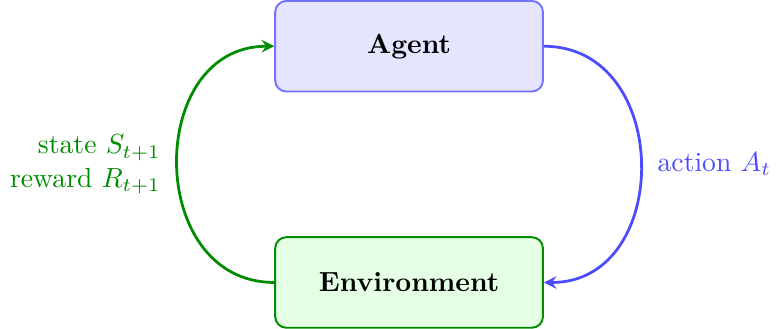
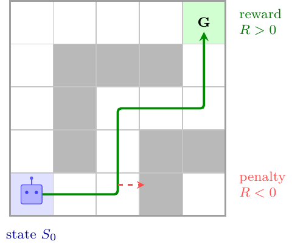
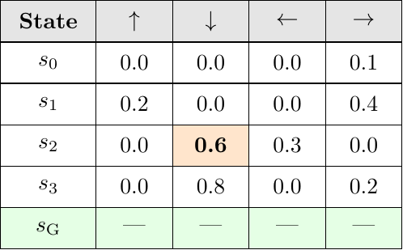

# Reinforcement Learning

Reinforcement learning models interaction as a loop between an agent and an environment. The agent observes a state, chooses an action, receives a reward, and uses that feedback to improve future decisions.



At each step:

1. the agent observes a state;
2. it chooses an action;
3. the environment returns a new state and a reward;
4. the learner updates value estimates or policy behavior.

The objective is not to predict a fixed label. It is to choose actions that maximize long-term reward.

## States, Actions, Rewards

In the maze examples:

- the state is the current cell;
- the actions are movements such as up, down, left, and right;
- the goal gives a positive reward;
- invalid or undesirable moves can give penalties;
- ordinary steps can have a small negative reward to encourage shorter paths.



Reward design is part of the model. Sparse rewards make learning harder but cleaner; shaped rewards can speed learning but may accidentally teach the wrong behavior.

## Exploration vs Exploitation

The agent must exploit actions that currently look good and explore actions whose value is still uncertain.

An epsilon-greedy policy is the simplest tradeoff:

```text
with probability epsilon: choose a random valid action
otherwise: choose the action with highest known value
```

Early training usually benefits from larger `epsilon`; later training benefits from lower `epsilon`.

## Q-learning

Q-learning is an off-policy temporal-difference method. It learns an estimate:

```text
Q(s, a)
```

for the expected long-term return of taking action `a` in state `s`.

The update uses the best estimated next action:

```text
Q(s,a) <- Q(s,a) + alpha * (r + gamma * max_a' Q(s',a') - Q(s,a))
```

Only one table entry changes on each interaction. Useful reward information therefore propagates gradually over many episodes.

## SARSA

SARSA is on-policy. Its update uses the action actually selected at the next state:

```text
Q(s,a) <- Q(s,a) + alpha * (r + gamma * Q(s',a') - Q(s,a))
```

This makes SARSA more conservative in tasks where exploration itself can be risky.

## Q-learning vs SARSA



Q-learning learns the value of the greedy policy it is moving toward, even while exploration collects experience. SARSA learns the value of the policy actually followed during training.

Use Q-learning when the goal is the best greedy policy after learning. Use SARSA when the learned behavior should reflect the risk of exploratory actions.

Implementation:

- `nunn/reinforcement/inc/nu_qlearn.h`
- `nunn/reinforcement/inc/nu_sarsa.h`

Demo programs:

- `maze`
- `path_finder`

## DQN

`Dqn` replaces a tabular Q-table with an `MlpMatrixNN`. The network receives a state representation and returns one Q-value per action.

Classic DQN needs two stabilizers:

- replay buffer: stores transitions and samples random mini-batches;
- target network: computes the Bellman target with weights that are synchronized only periodically.

The target for one transition is:

```text
target = r                         if terminal
target = r + gamma * max_a Q_target(s',a) otherwise
```

Only the output entry for the action actually taken is moved toward this target. Other action outputs are left at their current prediction for that training sample.

Implementation:

- `nunn/reinforcement/inc/nu_dqn.h`
- `nunn/reinforcement/src/nu_dqn.cc`
- `nunn/reinforcement/inc/nu_replay_buffer.h`

Demo:

- `dqn_maze`

